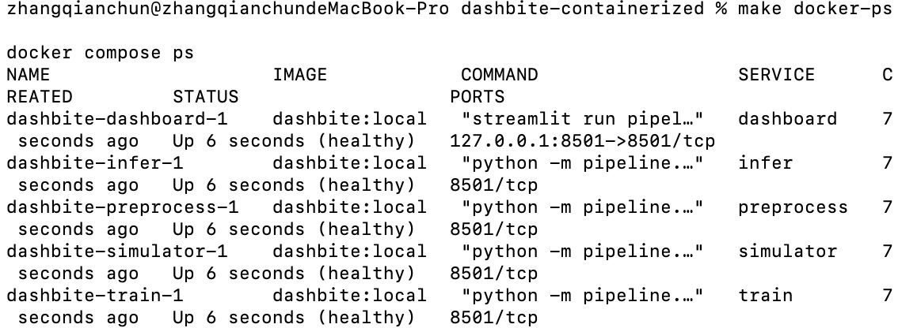
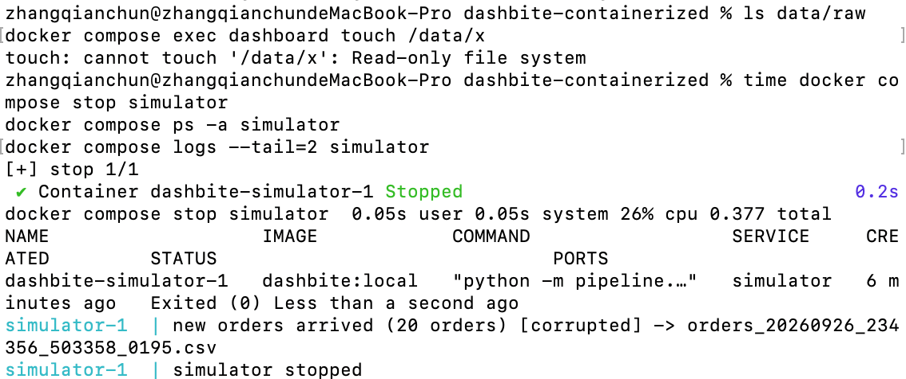
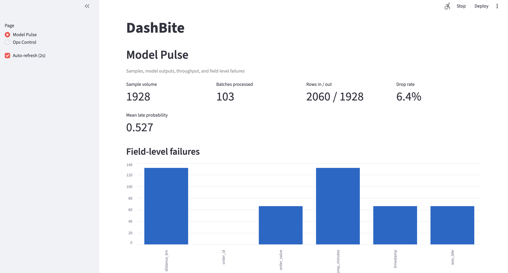

# DashBite — Simple Stage-by-Stage ML Pipeline

Teaching demo of a modular data + ML application. **DashBite** predicts whether a food-delivery order will be **late**.

Stages are separate Python modules that share folders under `data/`. Training and inference are **independent processes** coupled only by timestamped checkpoints in `data/models/`. Inference always uses the **newest** checkpoint.

It runs as plain local processes, or as containers with Docker Compose (see [Run with Docker](#run-with-docker)).

## Assignment: AI-assisted containerization (Option 1)

**Option 1 — extend and containerize DashBite.** I started from the class demo
*before* its Docker commit (`2c75df2`, 33 passing tests, no container files), so
the Dockerfile, Compose setup and container-readiness changes in this repo came out
of my own Architect → Builder → Tester workflow rather than the class files.

**Purpose:** run the whole five-stage pipeline with one command, and make it behave
correctly as containers: configurable storage, clean shutdown, meaningful health
checks, and tests that run inside the image.

| | Baseline (class demo) | This repo |
|---|---|---|
| Run | five terminals | `make docker-up` (one image, five services, one named volume) |
| Data location | fixed `<project>/data` | `DATA_ROOT` env var; `/data` in containers |
| `docker stop` a worker | ignores SIGTERM → 10 s wait, killed (exit 137) | **0.38 s, exit 0**, logs `<stage> stopped` |
| Health | none | heartbeat probe for workers, `/_stcore/health` for the dashboard |
| Handoff files | readers could see half-written files | atomic write (temp file + rename) |
| Tests | 33, host only | 62 passed + 1 skipped on host; same suite in the image (`make docker-test`) |

Plan: [docs/plan.md](docs/plan.md) · Transcripts: [docs/transcripts/](docs/transcripts/)

### Manual smoke test (macOS, Apple M4, Docker Desktop, real `python:3.12-slim`)

- `make docker-up` on a fresh volume: all five services `(healthy)` after ~6 s.
- `/data` owned by `app:app` (uid 10001); the five data folders were created.
- Logs showed orders → preprocessed → trained checkpoint → scored; corrupted batches kept 14/20 rows.
- Dashboard health returned `ok`; Model Pulse showed 103 batches and 1,928 samples, updating every 2 s.
- Host `data/raw` stayed empty; writing to the dashboard's mount failed with `Read-only file system`.
- `docker compose stop simulator`: 0.38 s, `Exited (0)`, last log line `simulator stopped`.

<p>
  
  
</p>


### How each AI role contributed

- **Architect** inspected the code and wrote `docs/plan.md`. It found a real bug I had
  not noticed: the dashboard hard-coded `PROJECT_ROOT` as its data location, so in a
  container it would have shown an empty page. My follow-up questions added the
  volume-ownership analysis (§3.5), the heartbeat threshold reasoning (§3.3) and the
  atomic-write measurements (§3.6).
- **Builder** implemented the six plan steps with 26 new tests and left the 33
  original tests untouched. It could not pull `python:3.12-slim` in its sandbox, so I
  verified the real image on my Mac and sent back three decisions.
- **Tester** reviewed the work against the plan and found two important issues: a
  preprocess backlog could delay shutdown past Docker's 10 s limit, and the tests
  would not catch several regressions (for example, writes bypassing the atomic
  rename). I chose which findings to fix.

### Recommendations I accepted

- **Atomic writes** (Architect). I asked how likely half-written files were; it
  measured 1 crash in 6,461 batches at 200× the demo's poll rate. I included the fix
  because `restart: on-failure` would otherwise hide these crashes as silent restarts.
- **Per-file stop check in preprocess** (Tester), so a large backlog no longer blocks
  shutdown or makes a busy worker look unhealthy.

### Recommendations I changed or rejected

- **Architect put complete working files in the plan.** I pushed back: the Architect
  should design, not build. The plan was revised to keep interfaces and acceptance
  criteria, and the Builder implemented from the design.
- **`init: true` for the start-up window** (Tester). Rejected: the window is under
  2 s, nothing has been written yet, and it would change the signal path the plan had
  already measured.
- **Silencing the pandas `UserWarning`** in preprocess logs. I kept it: the plan does
  not change pipeline logic, and the warning is honest evidence of corrupted batches.
- I also limited the Tester's test additions to the three most important gaps to keep
  the final change small.

### How I verified the result myself

- Ran `make test` and `make docker-test` on my Mac after every stage. The Builder's
  image was first proven here, on the real `python:3.12-slim`.
- Checked `git diff --stat tests/` to confirm none of the 33 original tests changed.
- Ran the manual smoke test above and timed shutdown myself.
- After the Tester fixes, reran the tests and a short smoke check
  (`make docker-clean`, `make docker-up`, `make docker-ps`, stop preprocess).

## Stages

| Stage | Module | What it does |
|-------|--------|----------------|
| 0 | `pipeline.config`, `pipeline.paths` | Shared config + data folders |
| 1 | `pipeline.simulator` | Writes timed CSV batches to `data/raw/` (“new orders arrived”) |
| 2 | `pipeline.preprocess` | Drops bad rows, adds `hour` / `is_peak` → `data/features/` |
| 3 | `pipeline.train` | Retrains when ≥ `TRAIN_EVERY_N_EVENTS` new labeled rows; writes checkpoints |
| 4 | `pipeline.infer` | Scores unscored rows with newest checkpoint → `data/predictions/` |
| 5–6 | `pipeline.dashboard` | Streamlit: **Model Pulse** + **Ops Control** |

## Setup

```bash
make install
```

Or manually:

```bash
python3 -m venv .venv
source .venv/bin/activate
pip install -r requirements.txt
```

## Makefile shortcuts

```bash
make help          # list targets
make test          # full pytest gate
make run           # start all stages in background + dashboard
make stop          # stop background pipeline
make clean-data    # wipe runtime CSVs/checkpoints under data/
```

Docker: `make docker-up`, `make docker-ps`, `make docker-logs`, `make docker-down`, `make docker-clean`, `make docker-test` (see [Run with Docker](#run-with-docker)).

Foreground single stages: `make simulator`, `make preprocess`, `make train`, `make infer`, `make dashboard`.

Known issue (baseline): on Linux, `make stop` (and so `make run`, which calls it) may exit with "Terminated", because its `pkill -f` lines match the shell running them. It works on macOS.

## Testing gate (required after every stage)

After each stage you implement or change, run the **full** suite:

```bash
pytest
```

That runs **unit**, **regression**, and **integration** tests together so new work cannot break older stages.

```bash
pytest -m unit
pytest -m regression
pytest -m integration
```

Layout:

```
tests/
  unit/
  regression/
  integration/
  fixtures/
```

## Run the pipeline (separate terminals)

Use a small retrain threshold for demos:

```bash
export TRAIN_EVERY_N_EVENTS=50
export BATCH_SIZE=20
```

Terminal 1 — intake:

```bash
python -m pipeline.simulator
```

Terminal 2 — preprocess:

```bash
python -m pipeline.preprocess
```

Terminal 3 — train (write path only):

```bash
python -m pipeline.train
```

Terminal 4 — infer (read path only; picks newest checkpoint):

```bash
python -m pipeline.infer
```

Terminal 5 — dashboards (Streamlit only adds the script's own folder to the import path, so point `PYTHONPATH` at the repo root or `import pipeline` fails; `make dashboard` does this for you):

```bash
PYTHONPATH=. streamlit run pipeline/dashboard/app.py
```

## Run with Docker

Needs Docker Desktop (macOS) or Docker Engine (Linux) with the `docker compose` plugin, plus `make`. No local Python or `make install` is needed.

One image (`dashbite:local`) runs every stage; each Compose service overrides the command. All five services share the named volume `dashbite_dashbite-data`, mounted at `/data` (the dashboard mounts it read-only).

```bash
make docker-test     # build the image and run the pytest suite inside it
make docker-up       # build if needed, start all five services in the background
make docker-ps       # status and health; all five should say (healthy) within ~30 s
make docker-logs     # follow all logs (SERVICE=infer for one service; Ctrl-C stops following)
make docker-down     # stop and remove containers; the data volume is kept
make docker-clean    # also delete the data volume for a fresh start
```

The dashboard is at http://localhost:8501 (published on localhost only; change the port to `"8501:8501"` in `compose.yaml` to show it to other machines). The same knobs as `make run` work: `make docker-up BATCH_SIZE=50`.

How it behaves:

- **Data lives in the volume, not in `./data`.** Host runs (`make run`) and containers never share files. `make stop` any host pipeline first, or the port clashes.
- **Stopping is graceful.** Workers finish their current iteration on SIGTERM and exit 0 (`<stage> stopped` in the log), so `make docker-down` takes about a second. Crashes restart the stage (`restart: on-failure`); a clean stop does not.
- **Health checks** run `python -m pipeline.healthcheck <stage>`. Workers touch a heartbeat file after every loop iteration (preprocess also after each file it catches up on) and report unhealthy when it is older than `HEARTBEAT_MAX_AGE_SECONDS`; the dashboard is probed at `/_stcore/health`. This is liveness, not progress, and plain Compose only *reports* unhealthy containers; it does not restart them (Kubernetes liveness probes would).
- **Runs as a non-root user** (`app`, uid 10001). A fresh volume inherits `/data` ownership from the image. If workers crash-loop with `PermissionError: ... '/data/raw'`, the volume was created by a broken build: run `make docker-clean`, then `make docker-up`. For a bind mount on Linux instead of the named volume, `chown 10001` the host directory or set `user:` in `compose.yaml`.
- **Keep one replica per service.** File markers are not multi-writer safe; see [docs/docker-k8s-guide.md](docs/docker-k8s-guide.md).
- Long sessions slow down because stages re-read every CSV on each poll; `make docker-clean` between sessions.

## Config (environment)

| Variable | Default | Meaning |
|----------|---------|---------|
| `TRAIN_EVERY_N_EVENTS` | `2000` (`make` and Docker: `50`) | Retrain after this many **new** labeled rows |
| `BATCH_SIZE` | `50` (`make` and Docker: `20`) | Orders per simulator tick |
| `POLL_INTERVAL_SECONDS` | `2.0` | Sleep between polls/ticks |
| `RANDOM_SEED` | `42` | Training seed |
| `CORRUPT_BATCH_RATE` | `0.25` | Fraction of batches that include NaNs / bad types |
| `DATA_ROOT` | `<project>/data` (image: `/data`) | Shared pipeline data directory itself (holds `raw/`, `features/`, ...) |
| `HEARTBEAT_DIR` | unset, so no heartbeat (image: `/tmp/dashbite`) | Where workers touch `<stage>.heartbeat` after each loop iteration |
| `HEARTBEAT_MAX_AGE_SECONDS` | `max(30, 3 × POLL_INTERVAL_SECONDS)` | Staleness limit for the worker health probe |
| `DASHBOARD_HEALTH_URL` | `http://127.0.0.1:8501/_stcore/health` | Dashboard health probe target |

The first default in each row is the code's own (plain `python -m pipeline.<stage>`). The Makefile exports demo-friendly values for the two knobs marked above, and `compose.yaml` falls back to the same values, so `make run`, `make docker-up` and a plain `docker compose up` all start with a threshold of 50 and batches of 20.

Code that passes an explicit `base` (as the tests do) still gets `base/data`; otherwise `DATA_ROOT` wins over the default.

Preprocess logs per-batch **throughput** and **field-level failures** to `data/quality/batch_quality.csv`. Model Pulse shows these live.

## Design notes for class

- Intake uses **batch CSV files** under the hood; logs say “new orders arrived”.
- Train **only writes** `data/models/checkpoint_*.joblib`.
- Infer **only reads** that folder and never imports train.
- Dashboards read `data/features/` and `data/predictions/` — test the metric helpers with `pytest`, not the browser UI.
